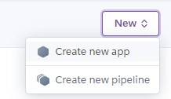
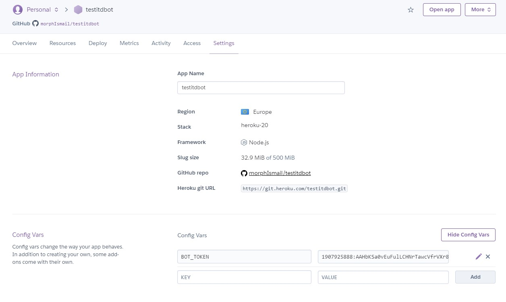
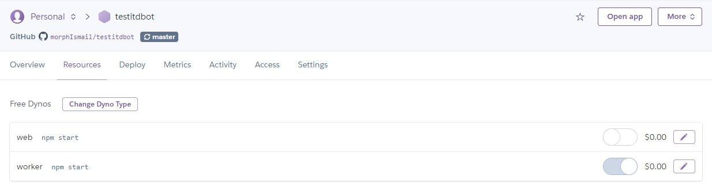
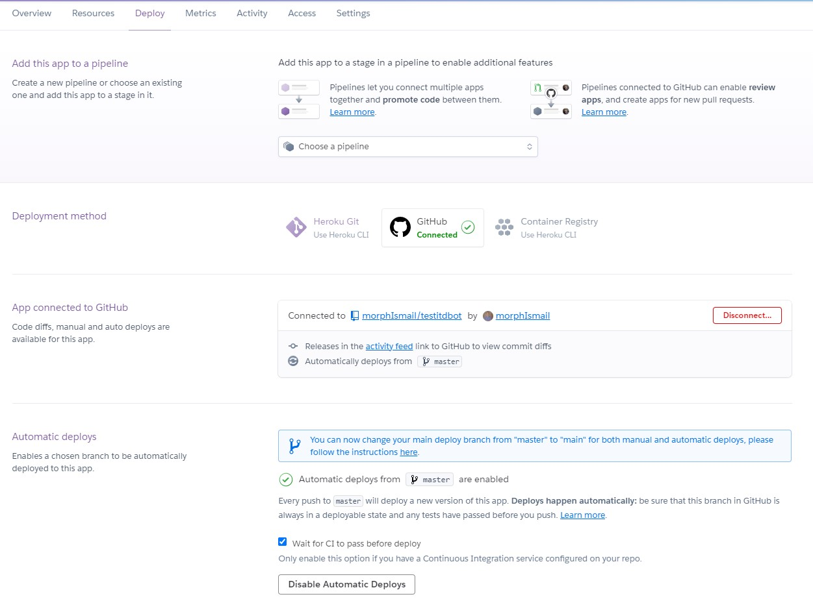
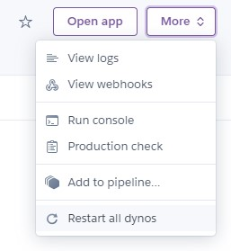
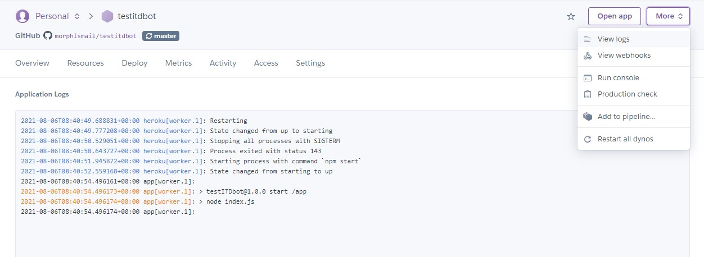

# Создание телеграм бота на Telegraf.js

## Регистрация бота в Телеграм

- В Телеграме найти бота @BotFather
- Ввести команду /newbot
- Следуя подсказкам придумать название бота и логин для него
- Получить ссылку на нового бота и API токен
- Ввести команду /mybots
- Выбрать своего бота и нажать Edit Bot
- Добавить информацию description, about, botpic, commands

## Инициализация проекта

- Создать папку с названием проекта
- Открыть проект в своей IDE или редакторе
- Открыть терминал и перейти в папку с проектом
  > **ls, dir** посмотреть список каталогов  
  > **cd ..** перейти на уровень выше  
  > **cd каталог** перейти в каталог
- проверить версию node.js если нет версии, то установить [node.js](https://nodejs.org/en/)
  > **node -v** проверить версию
- инициализировать проект (создать файл package.json)
  > **npm init -y**
- установить [nodemon](https://www.npmjs.com/package/nodemon)
  > **npm i -D nodemon**
- установить [telegraf](https://www.npmjs.com/package/telegraf)
  > **npm i telegraf**
- установить [dotenv](https://www.npmjs.com/package/dotenv)
  > **npm i dotenv**
- Создать **файл .env** и записать в него:
  > BOT_TOKEN = Токен из @BotFather
- Создать **файл index.js** и записать в него:
  > const { Telegraf, Markup } = require("telegraf")  
  > require("dotenv").config()  
  > const bot = new Telegraf(process.env.BOT_TOKEN)  
  > bot.start((ctx) => ctx.reply('Welcome'))  
  > bot.help((ctx) => ctx.reply('Send me a sticker'))  
  > bot.on('sticker', (ctx) => ctx.reply('Like'))  
  > bot.hears('hi', (ctx) => ctx.reply('Hey there'))  
  > bot.launch()  
  > process.once('SIGINT', () => bot.stop('SIGINT'))  
  > process.once('SIGTERM', () => bot.stop('SIGTERM'))
- Создать **файл .gitignore**
  > /node_modules  
  > .env  
  > package-lock.json
- Создать **файл Procfile**
  > worker: npm start
- Изменить скрипты в файле **package.json**
  > "scripts": {  
  >  "start": "node index.js",  
  >  "dev": "nodemon index.js"  
  > },
- Запустить проект командой
  > npm run dev

## Деплой проекта на Heroku

- Зарегистрироваться на [GitHub](https://github.com/) и войти
- Создать репозиторий и запушить код бота
- Зарегистрироваться на [Heroku](https://www.heroku.com/) и войти
- Создать новое приложение  
  
- Добавить константу с API токеном  
  
- Переключить Dyno с web на worker  
  
- На вкладке Deploy связать проект с репозиторием GitHub  
  
- Включить Automatic deploys (опционально)
- Запусть Manual Deploy
- Перезагрузить все Dyno  
  
- Просматривать логи  
  

### Полезные материалы

- [Видео урок по созданию бота](https://youtu.be/YxHWfDdjIek)
- [Обзор моего бота](https://youtu.be/IZj7up7CDdU)
- [Шаблонные строки](https://youtu.be/OPeujASczVM)
- [Тернарный оператор](https://youtu.be/C0rqUyNI5zA)
- [Курс по JavaScript](https://www.youtube.com/playlist?list=PLuY6eeDuleINoCQtGZsMoVVCSgEH7gKQ5)
- [Перехват ошибок try catch](https://youtu.be/jMoyWtoDtYA)
- [Курс по Git + GitHub](https://www.youtube.com/playlist?list=PLuY6eeDuleIOMB2R_Kky05ZfiAx2_pbAH)

### Автору на кофе

Сбер VISA: 4274 3200 3233 1582  
[Yoomoney](https://yasobe.ru/na/itdoctor)  
[PayPal](https://paypal.me/itdoctorstudio)

### Контакты ITDoctor

[YouTube](https://www.youtube.com/c/ITDoctor)  
[Telegram](https://t.me/itdoctorstudio) и бот [@itdoctorNavigatorBot](https://t.me/itdoctorNavigatorBot?start)  
[Курсы на Udemy](https://www.udemy.com/user/useinov-ismail-asanovich/)  
[GitHub](https://github.com/morphIsmail)  
[VK](https://vk.com/itdoctorstudio)  
[Instagram](https://instagram.com/ismail_asanovich)
